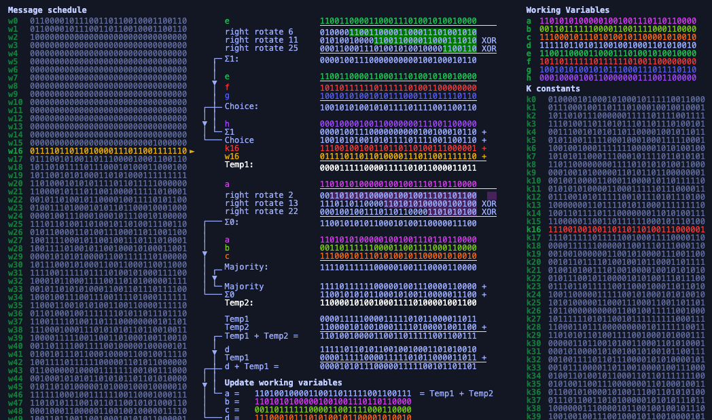

<<<<<<< HEAD

# Sha256algorithm

Sha256 algorithm explained online step by step visually [sha256algorithm.com](https://sha256algorithm.com/)
This website will help you understand how a sha256 hash is calculated from start to finish.

I hope this will be helpful for students learning about hash functions and sha256.

The code it's quite messy and probably there are some parts that don't follow the react way.

Ask me anything at [@manceraio](https://twitter.com/manceraio)

## Install 

I built this using create-react-app. If you want to play with it, just install javascript dependencies:

`npm install`

and start local server:

`npm start`
=======
# RIPEMD-160 Interactive Visualization

An educational web-based visualization of the RIPEMD-160 cryptographic hash function, inspired by [sha256algorithm.com](https://sha256algorithm.com/).

## Overview

This interactive visualization helps users understand the RIPEMD-160 hashing algorithm by showing step-by-step execution of the dual-lane compression function. RIPEMD-160 is widely used in cryptographic applications, including Bitcoin address generation.

## Features

### 🔍 **Input Preprocessing**
- Visual display of original input message
- Message padding demonstration
- Length encoding in bits/bytes

### 📦 **Message Block Preparation**
- Splitting input into 512-bit blocks
- Visual representation of 16 32-bit words per block
- Hexadecimal display of each word

### ⚙️ **Dual-Lane Compression Function**
- **Left Lane**: Traditional RIPEMD rounds (F→G→H→I→J)
- **Right Lane**: Reverse order rounds (J→I→H→G→F)
- Real-time register updates (A, B, C, D, E for each lane)
- Step-by-step operation display showing:
  - Current round function
  - Message word being processed
  - Round constants
  - Bit rotation amounts

### 🎮 **Interactive Controls**
- **Calculate Hash**: Process entire message at once
- **Step Through**: Enable step-by-step mode
- **Play/Pause**: Automatic stepping through rounds
- **Next Step**: Manual step advancement
- **Reset**: Return to initial state

### 📊 **Visual Feedback**
- Color-coded lanes (green for left, orange for right)
- Register value highlighting when changed
- Current operation details for each lane
- Round and function information display

## How to Use

1. **Enter Input**: Type any message in the input field
2. **Calculate Hash**: Click "Calculate Hash" to see the complete process
3. **Step Through**: Click "Step Through" to enable interactive mode
4. **Navigate**: Use Play/Pause or Next Step to walk through each round
5. **Observe**: Watch register values change and operations execute

## Educational Value

This visualization demonstrates:

- **Dual-Lane Design**: How RIPEMD-160's two parallel processing lanes work
- **Round Functions**: The five different functions (F, G, H, I, J) and their applications
- **Message Scheduling**: How input words are selected in different orders for each lane
- **Bit Operations**: Rotation, addition, and logical operations in action
- **Security Properties**: The complexity arising from dual-lane processing

## Algorithm Details

### Round Functions
- **F(x,y,z)**: `x ⊕ y ⊕ z` (XOR)
- **G(x,y,z)**: `(x ∧ y) ∨ (¬x ∧ z)` (selection)
- **H(x,y,z)**: `(x ∨ ¬y) ⊕ z` (majority)
- **I(x,y,z)**: `(x ∧ z) ∨ (y ∧ ¬z)` (selection)
- **J(x,y,z)**: `x ⊕ (y ∨ ¬z)` (XOR with OR-NOT)

### Round Constants
- **Left Lane**: `0x00000000`, `0x5a827999`, `0x6ed9eba1`, `0x8f1bbcdc`, `0xa953fd4e`
- **Right Lane**: `0x50a28be6`, `0x5c4dd124`, `0x6d703ef3`, `0x7a6d76e9`, `0x00000000`

### Processing
- **80 rounds total** (16 rounds × 5 functions)
- **Dual lanes** process in parallel with different word orders
- **Final combination** merges both lane results

## Technical Implementation

- **Pure JavaScript**: No external dependencies
- **Responsive Design**: Works on desktop and mobile
- **Educational Focus**: Clear visual representation over performance
- **Step Tracking**: Complete algorithm state capture for visualization

## Files

- `index.html` - Main visualization interface
- `style.css` - Visual styling and responsive design
- `ripemd160-visualizer.js` - RIPEMD-160 implementation with visualization hooks
- `ripemd160.c` - Original C reference implementation

## Browser Compatibility

Works in all modern browsers supporting:
- ES6 JavaScript features
- CSS Grid and Flexbox
- TextEncoder API

## Educational Use

Perfect for:
- **Cryptography courses** studying hash functions
- **Computer science students** learning about algorithms
- **Security professionals** understanding RIPEMD-160
- **Developers** working with cryptographic libraries
- **Anyone curious** about how hash functions work internally

## License

Open source - feel free to use, modify, and distribute for educational purposes.

## References

- [RIPEMD-160 Specification](https://homes.esat.kuleuven.be/~bosselae/ripemd160.html)
- [SHA-256 Algorithm Visualization](https://sha256algorithm.com/) (inspiration)
- [RFC 2857: The Use of HMAC-RIPEMD-160-96](https://tools.ietf.org/html/rfc2857)
>>>>>>> eb8debe2e713ef364904224e8ce139cd2ecaa48d
